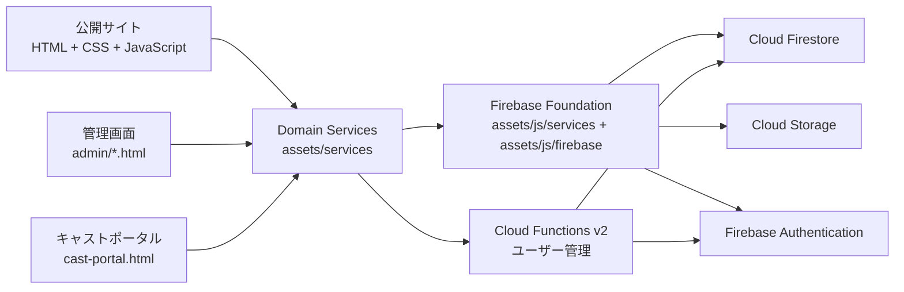
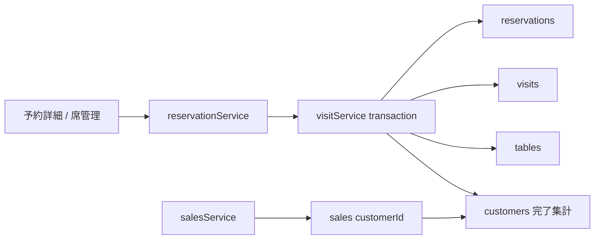
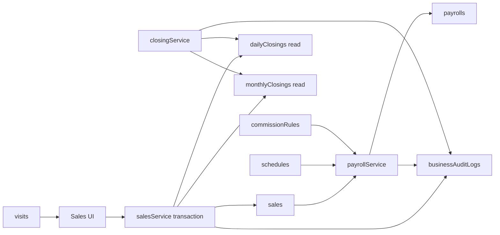

# ChouChou Clean Architecture

更新日: 2026-07-20
対象Version: 1.0.0
対象: `/Users/konponasahinin/Desktop/ChouChou`

## 1. 調査の前提

- 本文書はM1 Security RulesとM2 Service Layer移行後の正規アーキテクチャを示す。
- Firestoreのコレクション一覧は「コードから参照される論理構成」であり、本番データの全ドキュメント件数を取得したものではない。
- 画面デザイン、Firestoreコレクション、Cloud FunctionsのAdmin SDK境界は維持する。

## 2. システム全体像

画面はドメインServiceだけを利用し、Firebase SDK、コレクション名、Storageパス、Timestamp、Batch、Transactionを直接扱わない。`assets/js/services`はFirebase基盤または旧import互換入口であり、ドメイン規則は`assets/services`を正本とする。

### 2.1 依存ルール

1. UIは`assets/services`へだけ依存する。
2. Domain Serviceは共通Data Service、認証、Storage、Functionsクライアントを組み合わせる。
3. Firebase FoundationはSDK初期化、低レベルCRUD、キャッシュ、共有Listenerを担当する。
4. TransactionとBatchはService内部で完結させる。
5. Firebase Admin SDKは`functions/`だけが利用し、ブラウザへ管理権限を渡さない。
6. `ServiceError`派生型をUIとの共通エラー契約とする。

## 3. 画面一覧

HTMLは合計47ページ（公開・共通16、管理31）。旧Analytics URL 2ページを互換維持し、正式なM5画面を追加している。

### 3.1 公開・共通・キャストポータル

| ページ | 主な役割 | 判定 |
|---|---|---|
| `index.html` | ホーム、Today's Cast、Pick Up、News、Concept、ランキング等 | 使用中 |
| `cast.html` | キャスト一覧 | 使用中 |
| `cast-detail.html` | キャスト詳細、ギャラリー、予約、お気に入り、関連キャスト | 使用中 |
| `favorite.html` | LocalStorageのお気に入り一覧 | 使用中 |
| `favorites.html` | `favorite.html`への互換リダイレクト | 互換用 |
| `schedule.html` | 出勤一覧 | 使用中 |
| `news.html` | お知らせ一覧 | 使用中 |
| `gallery.html` | ギャラリー一覧 | 使用中 |
| `system.html` | 料金・システム案内 | 使用中 |
| `reservation.html` | WEB予約フォーム | 使用中 |
| `contact.html` | 問い合わせフォーム | 使用中 |
| `recruit.html` | 求人情報 | 使用中 |
| `recruit-form.html` | 求人応募フォーム | 使用中 |
| `cast-portal.html` | キャスト専用マイページ | 使用中・一部開発中 |
| `access.html` | 店舗アクセス | 使用中 |
| `404.html` | Hosting 404 | 使用中 |

### 3.2 管理画面

| ページ | 主な役割 | 判定 |
|---|---|---|
| `admin/login.html` | 管理ログイン | 完成 |
| `admin/403.html` | 権限エラー | 完成 |
| `admin/dashboard.html` | 売上、出勤、予約、ランキング、更新状況 | 完成 |
| `admin/analytics-dashboard.html` | 経営KPI・目標達成率・リアルタイム店舗状況 | 完成 |
| `admin/analytics-sales.html` | 売上軸別分析・ヒートマップ | 完成 |
| `admin/analytics-cast.html` | キャスト推移・比率・ランキング | 完成 |
| `admin/analytics-customers.html` | 顧客セグメント・LTV・ランキング・期限 | 完成 |
| `admin/notifications.html` | 既存データ・重要監査ログから生成する通知センター | 完成 |
| `admin/analytics.html` / `admin/analytics-customer.html` | 旧URL互換ページ | 使用中 |
| `admin/cast.html` | キャストCRUD、並び替え、公開・各種フラグ | 完成 |
| `admin/schedule.html` | 出勤登録・管理 | 完成 |
| `admin/reservations.html` | 予約CRUD、状態、検索、表示切替 | 完成 |
| `admin/reservation-detail.html` | 予約・席・キャスト・来店タイムライン統合 | 完成 |
| `admin/customers.html` | CRM一覧、検索、ランク管理 | 完成 |
| `admin/customer-detail.html` | 顧客情報、予約・来店・売上履歴 | 完成 |
| `admin/table-manager.html` | 席CRUD、リアルタイム状態、席移動 | 完成 |
| `admin/visit-history.html` | 来店履歴、状態・期間検索 | 完成 |
| `admin/sales.html` | 売上CRUD、検索、集計 | 完成 |
| `admin/sale-detail.html` | 料金・決済・来店連携の売上明細 | 完成 |
| `admin/payroll.html` | 給与設定・月別自動計算・明細表示 | 完成 |
| `admin/payroll-detail.html` | 給与計算、個別手当・控除、明細保存 | 完成 |
| `admin/closing.html` | 営業日締め・月締め・owner解除 | 完成 |
| `admin/users.html` | ユーザー作成、更新、無効化、キャスト紐付け | 完成 |
| `admin/news.html` | NEWS CRUD・公開期間 | 完成 |
| `admin/gallery.html` | 画像、カテゴリ、並び順、公開状態 | 完成 |
| `admin/event.html` | イベント・掲載期間・リンク管理 | 完成 |
| `admin/system.html` | 料金項目管理 | 完成 |
| `admin/recruit.html` | 求人内容・画像・公開状態 | 完成 |
| `admin/settings.html` | サイト設定 | 完成 |
| `admin/ranking.html` | ランキング確認・管理 | 完成 |

## 4. JavaScript棚卸し

JavaScriptは`assets/`配下98ファイル。Service WorkerとFunctionsを分離し、M2〜M5で機能別Service、純粋計算、共通エラー・Runtimeを追加した。

### 4.1 使用中の主なエントリーポイント

- 公開共通: `assets/app.js`, `assets/design-system-v11.js`, `assets/engagement.js`
- ホーム: `assets/main.js`, `assets/cast.js`, `assets/js/news.js`, `assets/gallery.js`, `assets/ranking.js`, `assets/home-engagement.js`
- キャスト: `assets/cast.js`, `assets/cast-detail.js`
- フォーム: `assets/reservation.js`, `assets/contact-form.js`, `assets/recruit-form.js`
- 管理共通: `assets/admin-login.js`, `assets/admin.js`, `assets/forbidden.js`
- 管理機能: `assets/cast-manager.js`, `assets/schedule.js`, `assets/reservations.js`, `assets/customers.js`, `assets/customer-detail-admin.js`, `assets/sales.js`, `assets/payroll.js`, `assets/users.js`, `assets/dashboard.js`, 各種`*-manager.js`
- ポータル: `assets/cast-portal.js`
- PWA: `service-worker.js`
- Backend: `functions/index.js`

### 4.2 共通モジュール・サービス層

| 領域 | ファイル | 状況 |
|---|---|---|
| Firebase初期化 | `assets/js/firebase/firebaseClient.js` | 使用中 |
| 認証 | `assets/js/services/authService.js` | 使用中 |
| RBAC | `assets/js/services/roleService.js` | 使用中 |
| Firestore基盤 | `assets/js/services/firestoreService.js` | 使用中 |
| 汎用データ処理 | `assets/services/dataService.js` | 使用中・正規入口 |
| 共通エラー／稼働状態／ログ | `assets/services/errors.js`, `serviceRuntime.js`, `serviceLogger.js` | 使用中 |
| 顧客 | `assets/services/customerService.js` | 使用中・M3 CRM対応 |
| 予約 | `assets/services/reservationService.js` | 使用中・M3来店フロー対応 |
| 席 | `assets/services/tableService.js` | 使用中・M3追加 |
| 来店 | `assets/services/visitService.js` | 使用中・M3追加 |
| 売上 | `assets/services/salesService.js` | 使用中・移行完了 |
| キャスト | `assets/services/castService.js` | 使用中・移行完了 |
| シフト／NEWS／ギャラリー | `assets/services/scheduleService.js`, `newsService.js`, `galleryService.js` | 使用中・移行完了 |
| 認証／ユーザー管理 | `assets/services/authService.js`, `userService.js` | 使用中・正規入口 |
| ダッシュボード／監査 | `assets/services/dashboardService.js`, `auditService.js` | 使用中・正規入口 |
| アクセスポリシー | `assets/services/accessPolicy.js` | Firebase非依存・RBAC正本 |
| 公開閲覧計測 | `assets/services/castViewService.js` | 公開ページ用軽量Service |
| 分析／通知 | `assets/services/analyticsService.js`, `analyticsCalculator.js`, `notificationService.js` | M5管理分析 |
| 給与 | `assets/services/payrollService.js` | 使用中・正規入口 |
| 売上・給与計算 | `assets/services/financeCalculator.js` | 使用中・Firebase非依存 |
| 締め | `assets/services/closingService.js` | 使用中・M4追加 |
| キャストポータル | `assets/services/castPortalService.js` | 使用中・正規入口 |
| UI共通 | `assets/js/components/*`, `assets/js/ui/*` | 使用中 |
| 変換・補助 | `assets/utils/*`, `assets/js/utils/*` | 一部使用・一部移行待ち |

### 4.3 互換エントリーポイント

削除前に実ブラウザと動的importを再確認すること。

| ファイル | 状況 | 推奨 |
|---|---|---|
| `assets/customerService.js` | 新サービスへの互換re-export | 移行完了まで維持 |
| `assets/reservationService.js` | 新サービスへの互換re-export | 移行完了まで維持 |
| `assets/js/services/reservationService.js` | 互換re-export | 移行完了まで維持 |

### 4.4 JavaScript境界

- cast / sales / customer / reservationの同名旧パスは、既存画面・将来の段階的更新を壊さないre-exportだけに限定する。認証、Firestore、給与、ポータル等の`assets/js/services`実装はFirebase Foundationとして維持する。
- `assets/app.js`、`assets/cast.js`、`assets/cast-manager.js`、`assets/schedule.js`が1,000行を超え、役割分割の余地がある。
- UIからFirestore / Storage / Firebase SDKへの直接アクセスは0件。機械監査条件は`MigrationReport.md`に記録する。
- `index.html`は複数の機能スクリプトを同時ロードするため、責務重複と初期読込量を継続監視する必要がある。

## 5. CSS棚卸し

CSSは合計17ファイル。M3〜M5の`operations.css`、`finance.css`、`analytics.css`を管理画面差分として追加している。

| ファイル | 概要 | 状況 |
|---|---|---|
| `assets/css/style.css` | 公開サイト基盤・歴代スタイル | 使用中、15,065行 |
| `assets/css/admin.css` | 管理画面共通 | 使用中、4,448行 |
| `assets/css/design-system-v11.css` | 公開共通デザインシステム | 使用中 |
| `assets/css/home-v11.css` | ホーム専用 | 使用中 |
| `assets/css/homepage-refine.css` | ホーム追加調整 | 使用中 |
| `assets/css/engagement-v72.css` | エンゲージメント機能 | 使用中 |
| `assets/css/mobile-v10.css` | モバイル調整 | 使用中 |
| `assets/css/interior-v14.css` | 下層ページ共通 | 使用中 |
| `assets/css/cast-detail-premium-v56.css` | キャスト詳細 | 使用中 |
| `assets/css/cast-portal.css` | キャストポータル | 使用中 |
| `assets/css/reservations.css` | 予約管理差分 | 使用中 |
| `assets/css/customers.css` | CRM一覧差分 | 使用中 |
| `assets/css/customer-detail.css` | CRM詳細差分 | 使用中 |
| `assets/css/users.css` | ユーザー管理差分 | 使用中 |

### CSSの重複・改善点

- `style.css`と`admin.css`が巨大で、過去バージョンの追記型ルールが蓄積している。
- 静的なセレクタ照合では約137件の複数ファイル定義候補がある。これはメディアクエリ等の意図的上書きも含むため、削除前にComputed Style確認が必要。
- ホームは最大6枚のCSSレイヤーを読み込み、読み込み順と詳細度に依存している。
- `:root`、カード、ボタン、バッジ、画像フォールバック、エラー表示などの共通定義が複数ファイルに分散している。
- `reservations.css`等の小規模ファイルが`admin.css`をimportする構成は意図的だが、HTML側の重複読込がないか継続確認が必要。
- 改善時は見た目を変えず、使用ページ、Computed Style、PC/スマホのスクリーンショットを基準に段階移行する。

## 6. Firestore論理構成

コード参照上のトップレベルコレクションは29種類。`announcementReads`はサブコレクション。

| コレクション | 主用途 | 主な書き込み元 | 状況 |
|---|---|---|---|
| `casts` | キャストプロフィール、公開、並び順、各種フラグ、`authUid` | キャスト管理、ポータル | 稼働 |
| `users` | UID、role、displayName、status、castId | Cloud Functions | 稼働 |
| `schedules` | 出勤予定・状態・時間 | 出勤管理 | 稼働 |
| `news` | お知らせ、公開期間 | NEWS管理 | 稼働 |
| `gallery` | 画像、カテゴリ、公開、並び順 | ギャラリー管理 | 稼働 |
| `sales` | 日別・キャスト別売上、指名、各種売上、customerId | 売上管理 | 稼働 |
| `customers` | CRM基本情報、来店集計、担当・お気に入り | CRM、予約連携 | 稼働 |
| `reservations` | 予約情報、顧客・指名キャスト、状態 | 予約管理、公開予約 | 稼働 |
| `visits` | 来店タイムライン、席、担当・指名種別、延長 | 予約詳細、席管理 | M3稼働 |
| `tables` | 席種別、定員、空席・使用・清掃・予約状態 | 席管理、来店Transaction | M3稼働 |
| `events` | イベント画像、期間、リンク | イベント管理 | 稼働 |
| `content` | 求人等の単一コンテンツ文書 | 求人管理 | 稼働 |
| `systemItems` | 料金項目、並び順 | システム管理 | 稼働 |
| `settings` | サイト・外部導線等の設定 | 設定管理 | 稼働 |
| `contacts` | 問い合わせ | 公開フォーム | 稼働 |
| `recruitApplications` | 求人応募 | 公開フォーム | 稼働 |
| `castViews` | キャスト閲覧・人気集計素材 | 公開サイト | 稼働 |
| `payrollSettings` | 時給、バック、控除設定 | 給与管理 | 稼働 |
| `commissionRules` | 指名・売上・ドリンク等のバックルール | 給与管理 | M4稼働 |
| `payrolls` | 月次給与計算、個別手当・控除 | 給与明細 | M4稼働 |
| `dailyClosings` | 営業日締めと決済別スナップショット | 締め処理 | M4稼働 |
| `monthlyClosings` | 月締めと売上スナップショット | 締め処理 | M4稼働 |
| `businessAuditLogs` | 売上・給与・コミッション・締め解除監査 | 各M4 Service | M4稼働・追記専用 |
| `payrollHistory` | 過去給与明細 | ポータル読取 | 読取実装、生成側不足 |
| `castRankings` | キャスト順位と推移 | ポータル読取 | 読取実装、集計側不足 |
| `shiftRequests` | キャストのシフト希望 | ポータル | 申請実装、承認側不足 |
| `castAnnouncements` | キャスト向けお知らせ | ポータル読取 | 読取実装、管理側不足 |
| `castPortalUsers` | ポータル固有状態 | ポータル | 稼働 |
| `auditLogs` | ユーザー管理操作の監査 | Cloud Functions | 稼働 |

サブコレクション:

- `castPortalUsers/{uid}/announcementReads`: キャスト向けお知らせの既読状態。

### データ整合性上の注意

- `customers`、`reservations`、`sales`は参照IDによる論理リレーションであり、RDBの外部キー制約はない。
- 来店確定時の顧客集計はサービス層でtransaction化されているが、旧データの`customerId`欠損を補完する移行処理は見当たらない。
- 公開フォームと管理画面の両方から予約が作られるため、顧客自動照合・重複顧客防止を同じサービスに統一する必要がある。
- M1で`firestore.rules`と`storage.rules`を追加し、M4.5でロール・本人データ・公開フォーム・予約〜締め統合を21ケースのEmulatorテストで検証済み。

### M3予約・来店トランザクション

画面はコレクション名やDocument Referenceを扱わない。来店状態、席状態、顧客来店集計は`visitService`のTransactionを整合性境界とする。

### M4売上・給与・締め境界

## 7. Cloud Storage

コード上で確認できる主な保存先:

- `casts/`
- `cast-profiles/`
- `gallery/`
- `news/`
- `events/`
- `event-banners/`
- `recruit/`

画像アップロード、削除、URL保存は実装済み。Storage Rulesはパス、ロール、画像形式、10MB上限、キャスト本人UID/castIdを検証する。

## 8. Cloud Functions

ローカル実装とFirebase CLIの稼働一覧が一致し、次の4つのCallable Functionが`asia-northeast1`、Node.js 22で稼働している。

| Function | 役割 | 状況 |
|---|---|---|
| `adminCreateUser` | Authユーザー作成、users作成、cast紐付け | 実装・稼働 |
| `adminListUsers` | Auth情報とFirestore usersの統合一覧 | 実装・稼働 |
| `adminUpdateUser` | 表示名、role、status、cast紐付け更新 | 実装・稼働 |
| `adminDeactivateUser` | Auth無効化と`status=inactive` | 実装・稼働 |

共通実装:

- 呼出者が`owner`かをFirestore `users`で検証。
- AuthとFirestoreの同期、キャスト`authUid`の付替え、`auditLogs`記録。
- ユーザー作成途中でFirestore処理が失敗した場合のAuthロールバック。

未実装:

- 予約のLINE・メール・Push通知、来店前通知。
- Google Calendar同期。
- 給与履歴生成、明細PDF、ランキング定期集計。
- 掲載期間終了などのサーバー側定期処理。
- シフト承認通知、キャスト向けお知らせ配信管理。
- CRM分析・CSV生成のサーバー処理。

なおCallable Functionsの`enforceAppCheck`は無効で、App Check強制は今後のセキュリティ課題。

## 9. Firebase Authentication / RBAC

### 実装済み

- Email/Passwordログイン、Auth状態監視、ログアウト、パスワード再設定メール。
- Firestore `users`から`owner / manager / staff / cast`を取得。
- ルートガードと権限外アクセス時の`admin/403.html`遷移。
- 管理メニューのロール別表示制御。
- `cast`は`cast-portal.html`のみ、`casts.authUid`で本人データに紐付け。
- ユーザー作成・更新・無効化はAdmin SDKを使うCloud Functions経由。

### 権限マトリクス

| 機能 | owner | manager | staff | cast |
|---|---:|---:|---:|---:|
| 全管理設定・ユーザー管理 | 編集 | 不可 | 不可 | 不可 |
| 売上・キャスト・シフト | 編集 | 編集 | 不可 | 本人分のみ |
| 予約 | 編集 | 編集 | 編集 | 不可 |
| お知らせ | 編集 | 権限設定に従う | 編集 | キャスト向け読取 |
| キャストポータル | 不可 | 不可 | 不可 | 利用可 |

### 未確認・改善点

- Email/PasswordプロバイダがFirebase Console上で有効かは、コードからは確認できない。
- メール確認必須化、MFA、初回パスワード変更強制は未実装。
- Firestore/Storage RulesはM1で追加済み。今後のコレクション追加時も明示ルールと回帰テストが必要。
- role/status変更後の既存セッション強制失効は未実装。
- App Check強制が無効。

## 10. ビルド・配信・品質管理

- Firebase Hostingはプロジェクトルートを静的配信し、`functions/**`等を除外する構成。
- Functions runtimeはNode.js 22。
- バンドラーは使用せず、HTMLからES Modules/通常scriptを直接読み込む構成。
- `cast-portal.webmanifest`と`service-worker.js`があり、PWAの基礎は実装済み。
- Firestore/Storage Rules、計算ロジック、RBAC契約、静的HTML/asset監査の自動テストを追加済み。ブラウザE2E、Functions/Auth統合テスト、CIは未実装。
- `firebase.json`にFirestore Rules/Storage RulesとEmulator設定を追加済み。

### 10.1 QA / Release gate

- `tests/finance`: 売上・給与・締め計算。
- `tests/analytics`: KPI・分析計算。
- `tests/qa`: RBACポリシー・HTML/asset静的監査。
- `tests/rules`: Firestore / Storage Rulesと予約〜締め統合。
- `QA_REPORT.md`: 実行結果と判定。
- `CHECKLIST.md`: deploy前後の確認手順。
- `KnownIssues.md`: 今回変更しない残課題。
- `BACKUP_PLAN.md`: Firestore / Storage / Auth / Functions構成の保全と災害復旧。
- `OPERATIONS_MANUAL.md`: 営業開始から締め・監査・障害初動までの標準手順。

## 11. 主要な技術的改善点

1. Firestore/Storage Rulesを本番反映し、以後のコレクション追加時に回帰テストを必須化する。
2. M2のService境界をCIで継続監査し、新規画面のFirebase直接アクセスを防止する。
3. `customers`・`reservations`・`sales`のID整合性、冪等更新、旧データ移行を設計する。
4. 巨大な`style.css`・`admin.css`と大規模JavaScriptを責務別に分割する。
5. 利用状況を確認しながら互換re-exportを段階的に整理する。
6. Auth Emulator / Firestore Emulatorを使ったRules・サービス層・主要業務フローのテストを追加する。
7. App Check、MFA、監査ログ、セッション失効を含む運用セキュリティを強化する。
